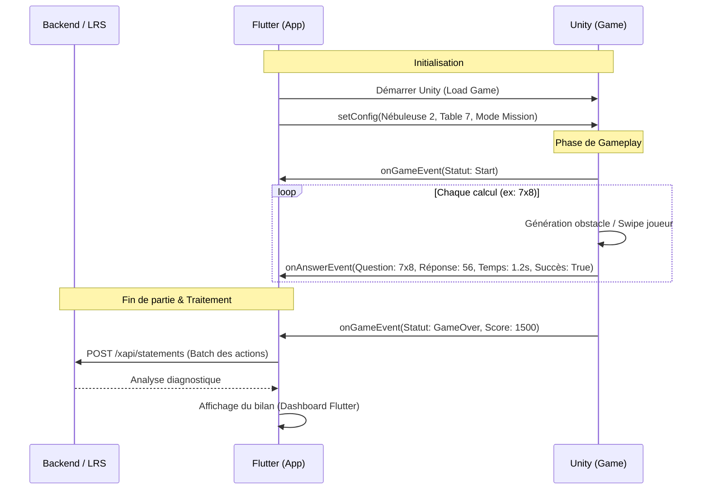
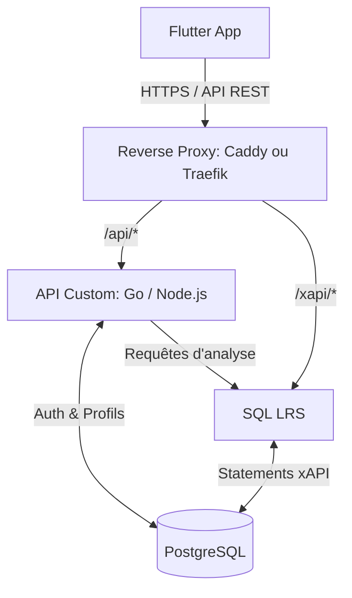

# Architecture Système : Application Éducative Souveraine

Ce document présente l'architecture technique, la structure des données d'apprentissage (xAPI) et la stratégie de déploiement pour votre application gamifiée d'apprentissage des tables de multiplication.

---

## 1. Architecture Logicielle et Communication Flutter ↔ Unity

La cohabitation entre Flutter (interface UI/UX, Hangar, Menus, Authentification) et Unity (Moteur 3D, Gameplay) se fait via le package `flutter_unity_widget`. 

Le principe clé est que **Unity agit comme un "composant" (View) intégré et contrôlé par Flutter**. 

### Schéma de Communication



### Mécanismes de passage de messages
- **Flutter vers Unity :** Utilisation de `UnityWidgetController.postMessage(gameObject, methodName, message)` 
  *Ex: `postMessage('GameManager', 'StartLevel', '{"table":7, "theme":"espace", "speed":1.5}')`*
- **Unity vers Flutter :** Unity envoie des messages texte (idéalement JSON) à Flutter via `UnityMessageManager.Instance.SendMessageToFlutter(message)` (qui est intercepté par le callback `onUnityMessage` côté Flutter).

**Bonne pratique :** Ne pas envoyer les requêtes HTTP/xAPI directement depuis Unity. Unity doit être "stupide" concernant le réseau : il se contente d'envoyer les événements bruts de gameplay à Flutter au format JSON. Flutter s'occupe de formater le xAPI, d'ajouter le token d'authentification et de communiquer avec le backend.

---

## 2. Intelligence et Analyse : Modélisation xAPI

L'utilisation du standard xAPI (Experience API) est un excellent choix pour l'interopérabilité. Voici la structure recommandée pour vos "Statements".

Chaque action significative dans le jeu génère un statement : **Actor** (Le joueur) -> **Verb** (L'action) -> **Object** (La question/le niveau).

### Verbes (Vocabulaire xAPI standard ADL)
- `initialized` : Le joueur lance une mission.
- `answered` : Le joueur traverse un portail (répond à un calcul).
- `completed` : Le joueur termine la mission.
- `mastered` : Le joueur réussit le Mode Défi (zéro erreur).

### Structure d'un Statement "Answered" (Exemple prioritaire)

C'est le statement le plus important. Il inclut le résultat et le contexte (vitesse de réponse, mode de jeu).

```json
{
  "actor": {
    "objectType": "Agent",
    "account": {
      "homePage": "https://votre-app.com",
      "name": "user-uuid-1234"
    }
  },
  "verb": {
    "id": "http://adlnet.gov/expapi/verbs/answered",
    "display": { "fr-FR": "a répondu" }
  },
  "object": {
    "objectType": "Activity",
    "id": "https://votre-app.com/activities/multiplication/7x8",
    "definition": {
      "type": "http://adlnet.gov/expapi/activities/question",
      "name": { "fr-FR": "Calcul 7 x 8" }
    }
  },
  "result": {
    "success": true,
    "response": "56",
    "duration": "PT1.2S",  // Format ISO 8601 pour 1.2 secondes
    "extensions": {
      "https://votre-app.com/xapi/extensions/expected-answer": "56",
      "https://votre-app.com/xapi/extensions/portal-choices": ["49", "54", "56"],
      "https://votre-app.com/xapi/extensions/game-speed": "normal"
    }
  },
  "context": {
    "contextActivities": {
      "parent": [
        { "id": "https://votre-app.com/activities/mission/table-7" }
      ],
      "grouping": [
        { "id": "https://votre-app.com/activities/nebuleuse/espace" }
      ]
    }
  }
}
```

### Le Moteur d'Analyse (Backend)
Avec cette structure riche enregistrée dans la base de données, votre backend peut exécuter des requêtes SQL (ou via l'API du LRS) pour générer les diagnostics :
*   *Table non automatisée :* Moyenne des `result.duration` > 2 secondes pour la `contextActivity` "Table 7".
*   *Confusion récurrente :* Filtrage sur `success: false` où `object.id` est "6x7" et `result.response` est "48" (qui est 6x8).

---

## 3. Stratégie de Déploiement Backend (Souverain & Léger)

Puisque nous voulons éviter les usines à gaz et les coûts variables (Firebase/AWS), la solution de l'auto-hébergement via un **Serveur Dédié ou VPS Linux** (ex: Hetzner, OVH, Scaleway) est idéale.

### Choix de la Stack Backend

1.  **LRS Open-Source (SQL LRS) :**
    Plutôt que de construire un LRS from scratch (ce qui est complexe si on veut respecter la norme), je recommande **SQL LRS** (par Yet Analytics). C'est un LRS ultra-performant, open-source, et conçu *spécifiquement* pour tourner sur une base **PostgreSQL**.
2.  **API Backend (Go ou Node.js) :**
    *   **Go (Golang)** est fortement recommandé ici : extrêmement performant, très faible consommation mémoire (idéal pour un petit VPS), et fortement typé.
    *   **Node.js** reste un bon choix si votre équipe est déjà à l'aise en JS/TS.
    Le rôle de cette API "Custom" :
    *   Gérer les comptes utilisateurs et l'authentification (JWT).
    *   Gérer la monnaie virtuelle et les achats du Hangar.
    *   Récupérer les statements xAPI depuis le LRS, effectuer l'analyse algorithmique, et formater le texte de diagnostic (ex: "La table de 7 n'est pas automatisée") pour le renvoyer à l'application Flutter.
3.  **Base de Données : PostgreSQL :**
    *   Une seule instance PostgreSQL hébergera deux schémas/databases distincts : un pour votre Backend Custom (utilisateurs, skins, monnaie), l'autre pour SQL LRS. PostgreSQL gère nativement le format JSONB, parfait pour les requêtes complexes sur les extensions xAPI.

### Architecture Déploiement (Docker Compose)

Tout peut tenir sur un seul VPS à 5€-10€/mois (ex: Hetzner CX22 - 2 vCPU, 4GB RAM) avec cette architecture Dockerisée :



### Avantages de cette approche :
*   **Souveraineté totale :** Vous possédez les serveurs, la base de données, et l'historique xAPI complet.
*   **Sécurité :** Caddy gère automatiquement les certificats SSL/TLS. Les échanges entre l'App et le Backend sont sécurisés par JWT. Le LRS peut être restreint pour n'accepter que les requêtes venant de votre Backend/App.
*   **Coût fixe :** Que vous ayez 10 ou 10 000 joueurs, le coût de base reste le prix du VPS (environ 5€/mois). Vous pourrez "Scale-up" le serveur si la charge augmente, sans subir la tarification à la requête des services Cloud.
*   **Performance :** L'association Go + Postgres + SQL LRS est taillée pour avaler des milliers de statements d'apprentissage à la seconde.

---

## 4. Pratiques de Développement (Clean Architecture & TDD)

Afin de garantir un code maintenable, évolutif et hautement testable, le projet (aussi bien côté Flutter que Backend) respectera strictement les principes de la **Clean Architecture** et du **TDD (Test-Driven Development)**.

### Clean Architecture
L'application sera divisée en couches distinctes pour séparer le code métier de l'interface utilisateur et de l'infrastructure :
*   **Domain (Couche Métier) :** Contient les Entités (ex: `User`, `GameSession`, `MathQuestion`) et les Use Cases (`SaveScore`, `GeneratexAPIStatement`). Cette couche est "pure", sans aucune dépendance externe (ni Flutter, ni base de données, ni réseau).
*   **Data (Couche Données) :** Implémente les interfaces (Contracts) définies dans le Domain. C'est ici que se trouvent les Repositories (ex: `PostgresUserRepository`, `LocalSettingsRepository`) et les Data Sources (API REST, SQLite local, Appels à Unity).
*   **Presentation (Couche UI) :** Côté Flutter, elle gérera l'interface et l'état de l'application via un gestionnaire d'état robuste (comme **Riverpod** ou **BLoC**).

**Avantage majeur pour l'intégration Unity :** Les messages bruts (JSON) reçus d'Unity seront interceptés par un `UnityDataSource` dans la couche Data, puis convertis en Entités par un Repository avant d'arriver dans la couche Domain. La logique métier sera ainsi totalement aveugle et indépendante d'Unity.

### TDD (Test-Driven Development)
Nous adopterons un cycle "Red-Green-Refactor" pour implémenter la logique complexe :
1.  **Tests Unitaires :** Indispensables pour tester les Use Cases de la couche Domain (ex: vérifier qu'un score parfait au mode "Défi" déclenche bien le déblocage du niveau suivant).
2.  **Tests de Mocks (Mockito/Mocktail) :** Les dépendances externes (comme le moteur Unity ou l'API backend) seront mockées pour tester la couche Présentation et Data de manière totalement isolée.
3.  **Tests d'Intégration (Flutter) :** S'assurer que l'UI réagit correctement aux changements d'état (ex: l'écran de fin de partie s'affiche avec le bon nombre d'étoiles).
